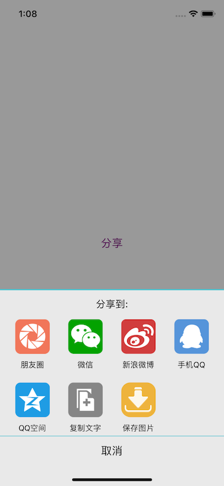

# ShareActivity

自定义分享菜单

### How to use

	#import "ShareActivity.h"

	- (void)showShareActivity:(id)sender
	{
    	ShareActivity *sa = [[ShareActivity alloc] initShareActivityView];
    	[sa show];
	}
	

